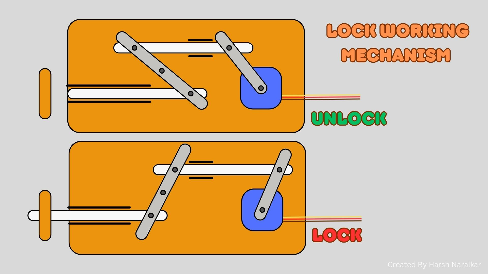
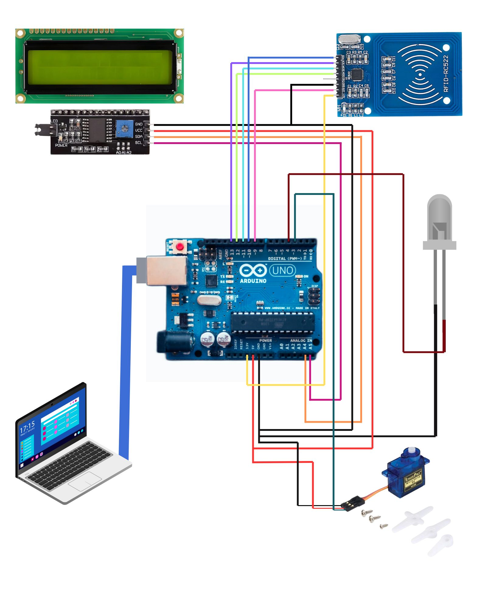

# RFID-Based Door Lock System

## Introduction  
This project implements an RFID-based door lock system using Arduino, integrating servo motors, an LCD display, and a security mechanism. It enhances security while reducing energy consumption, aligning with green technology principles. Additionally, the system includes a fail-safe security feature: after three incorrect RFID scans, an alert email is sent to the owner, notifying them of a potential unauthorized access attempt.

## Components Used  
- Arduino Uno  
- RFID Module (MFRC522)  
- Servo Motor  
- LCD Display (I2C)  
- LED Indicator  
- Computer for Serial Communication  

## Lock Structure

## Connection Tables  
### RFID Module Connections  
| RFID Pin | Arduino Pin |
|----------|------------|
| VCC      | 3.3V       |
| GND      | GND        |
| SS       | 10         |
| RST      | 9          |
| MOSI     | 11         |
| MISO     | 12         |
| SCK      | 13         |

### LCD Display (I2C) Connections  
| LCD Pin | Arduino Pin |
|---------|------------|
| VCC     | 5V         |
| GND     | GND        |
| SDA     | A4         |
| SCL     | A5         |

### Servo Motor Connection  
| Servo Pin | Arduino Pin |
|-----------|------------|
| VCC       | 5V         |
| GND       | GND        |
| Signal    | 3          |

### LED Indicator Connection  
| LED Pin | Arduino Pin |
|---------|------------|
| VCC     | 5V         |
| GND     | GND        |
| Signal  | 4          |

## COnnections Diagram

## **C++ (Arduino) Libraries Required:**
1. **`SPI.h`** – Required for SPI communication with the RFID module.  
2. **`MFRC522.h`** – Library for interfacing with the RFID (MFRC522) module.  
3. **`Servo.h`** – For controlling the servo motor that locks/unlocks the door.  
4. **`Wire.h`** – Required for I2C communication with the LCD display.  
5. **`LiquidCrystal_I2C.h`** – Library for controlling the I2C-based LCD.  

## **How to Install the Libraries in Arduino IDE**
1. Open **Arduino IDE**.
2. Go to **Sketch** > **Include Library** > **Manage Libraries**.
3. Search for the required libraries and install them:
   - **"MFRC522"** by Miguel Balboa
   - **"Servo"** by Arduino
   - **"LiquidCrystal I2C"** by Frank de Brabander

## **Python Libraries Required:**
1. `pyserial` – For reading data from the Arduino via serial communication.
2. `smtplib` – For sending email alerts when unauthorized access is detected.
3. `email` – For email message formatting.
4. `OpenCV-python` – For playing warning videos in case of unauthorized access.
5. `time` – For handling delays (built-in, no need to install).
6. `os` – For file handling operations (built-in, no need to install).
7. `sys` – For system-specific functions (built-in, no need to install).

## Functionality  
- RFID authentication is used to control door access.  
- A servo motor locks/unlocks the door based on valid card scans.  
- An LCD displays access status.  
- Unauthorized access attempts trigger warning Mail Alerts via a Python script.  
- The system resets after three wrong attempts.  
- After three failed authentication attempts, the Python script sends an alert email to the owner, notifying them of possible unauthorized access.

## Code Implementation  
- **Arduino Code**: Handles RFID authentication, door control, and LED indications.  
- **Python Script**: Reads serial input from Arduino and plays corresponding alert videos. Additionally, it monitors incorrect attempts and triggers an email alert if three consecutive failures occur.

## Green Technology Aspects  
- **Energy Efficiency**: The system only activates when needed, reducing power consumption.  
- **Automation**: Reduces manual intervention and improves security.  
- **Sustainability**: Uses minimal hardware components, reducing electronic waste.  

## Conclusion  
This RFID-based door security system improves access control while promoting energy efficiency. The integration of IoT and automation enhances security while minimizing environmental impact. The inclusion of an email alert system further strengthens security by providing real-time notifications of unauthorized access attempts.

